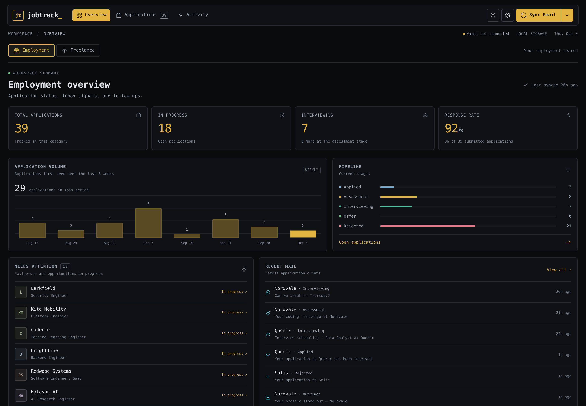
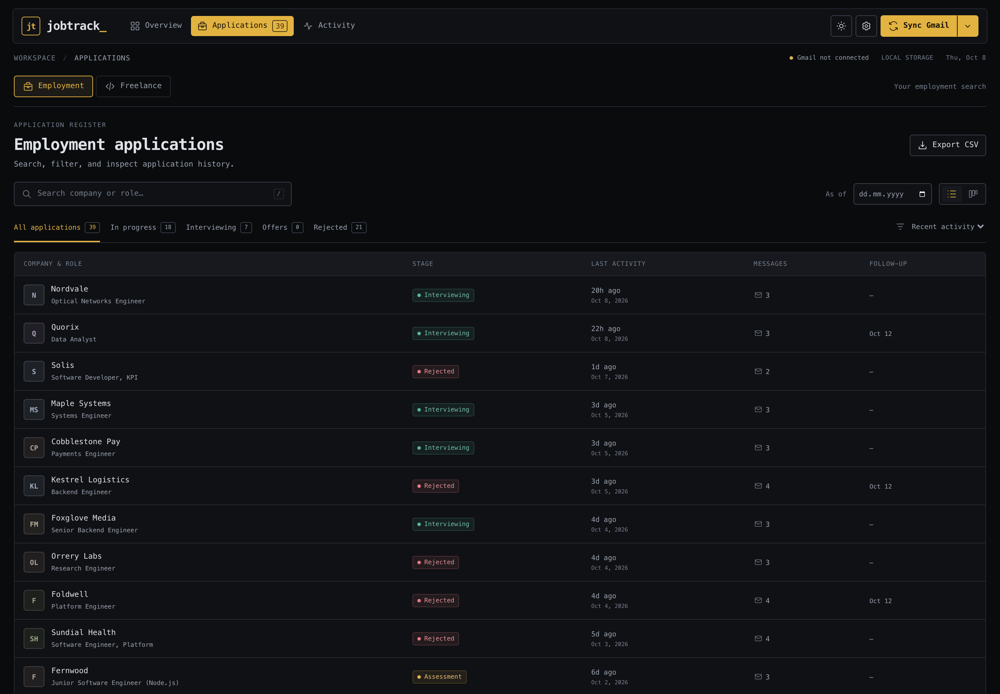
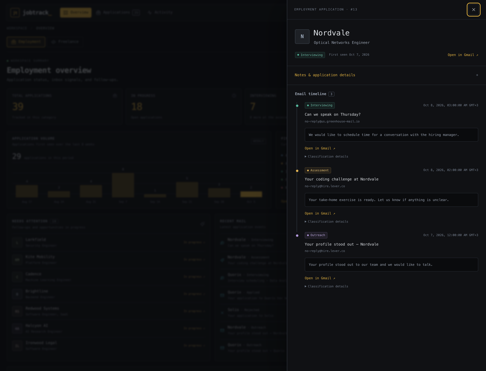

# jobtrack

A local job-search workspace built from the recruiting mail already in your
Gmail. Find applications, assessments, interviews, offers, and rejections; follow
each email timeline; and keep your next steps beside every opportunity.



The app runs on your own machine with Python, FastAPI, and SQLite. It asks Gmail
for **one** permission — `gmail.readonly` — so it can never send, delete, or
modify mail. Classification works from offline rules and is optionally assisted
by a local or hosted model.

| | |
| --- | --- |
| **Reads** recruiting mail you already received | **Cannot** send, delete, or modify mail |
| **Stores** everything in a local SQLite file | **Cannot** reach your inbox without your approval |
| **Runs** on `127.0.0.1` with no external service | **Cannot** be a hosted service — there is no account |

If you configure a hosted model provider, the email being classified is sent to
that provider for the length of the request. Rules-only mode (`--llm-mode off`)
and local models keep that content on your device. See
[SECURITY.md](SECURITY.md) for what lands on disk.

## Install

Python 3.10 or newer. From a clone:

```bash
uv venv
uv pip install -e "."
source .venv/bin/activate
```

Or with plain `pip`:

```bash
python3 -m venv .venv && source .venv/bin/activate
pip install -e .
```

Either way you get a `jobtrack` command. Check it with `jobtrack --help`.

## Authorize Gmail

There is no shared OAuth client here, and that is deliberate: your token goes to
your machine, not to someone else's server. Google requires you to create your
own client, which is the one part of setup that is not a single command.

1. Open [Google Cloud Console](https://console.cloud.google.com/) and create a project (or pick an existing one).
2. Enable the **Gmail API** for that project.
3. Under **Google Auth Platform → Branding**, set an app name and support email. Choose **External**.
4. If the app is in *Testing*, add your own address under **Test users**. Skip this if you publish the app.
5. Under **Data Access**, add exactly one scope:
   `https://www.googleapis.com/auth/gmail.readonly`
6. Create an **OAuth client ID** of type **Desktop app** and download the JSON.
7. Authorize:

```bash
jobtrack auth --credentials ~/Downloads/client_secret.json
```

A browser opens, you approve the read-only permission, and a token is cached at
`token.json` (mode `600`).

> **If your token stops working after about seven days:** your OAuth app is in
> *Testing*, where Google expires refresh tokens quickly. This is not a bug.
> Either publish the app (**Google Auth Platform → Publish app**) or re-run
> `jobtrack auth`. It is the single most common problem people hit.

## First sync

```bash
jobtrack serve
```

Then open [http://127.0.0.1:8765](http://127.0.0.1:8765).

Look before you import: open **Sync options**, set a lookback of 90 days and a
limit of 50, and choose **Preview first**. That lists candidate messages and
their classifications without changing anything. When it looks right, choose
**Sync Gmail**. Your token and database are reused on every later start.



The layout is deliberately dense: charcoal surfaces, amber controls, monospace
typography, compact top navigation, packed panels. The header toggle switches to
a warm light theme, and the layout adapts to narrow screens without a separate
mobile app. Press `/` to jump to application search.

- **Overview:** current stages, active opportunities, interview count, response rate, an eight-week activity chart, role categories, follow-ups, and recent mail.
- **Applications:** searchable list and board views; stage filters; CSV export; historical snapshots.
- **Activity:** recent recruiting messages and persistent sync history.
- **Sync options:** lookback, date bounds, message limit, custom Gmail search, whether to track mail you sent, and reclassification.
- **Settings:** provider connections, masked API keys, live model discovery, and a multi-model review team.

### One application, end to end

Every card is backed by the emails that produced it, and the status is derived
from those events rather than typed in by hand — so "did they ever reply, or did
I just wait?" is answerable from one panel.



Each event shows its sender, arrival time, the snippet that earned its label, a
link into the original Gmail conversation, and how it was classified. Correct
it when the mail disagrees; the correction sticks across later syncs.

## Command line

```bash
jobtrack sync --since 90 --limit 100          # import the last 90 days
jobtrack sync --track-sent --dry-run          # preview your own applications
jobtrack list --active                        # what is still open
jobtrack show 7                               # one application and its timeline
jobtrack stats                                # stage counts and response rate
jobtrack export --format csv -o applications.csv
jobtrack serve --port 9000 --no-browser
jobtrack schedule install --at 08:00          # daily import via launchd or cron
jobtrack logout
```

`--since` accepts a number of days, `7d`, `3m`, `2y`, or a calendar date.
`--as-of` replays stored history without refetching Gmail. Global `--db PATH`
selects another database and `--json` renders machine-readable output.

## Read more

- [Architecture](docs/architecture.md) — how a message becomes an application, and the database invariants
- [Model analysis](docs/models.md) — providers, the four modes, and multi-model consensus
- [Metrics and corrections](docs/metrics.md) — response rate, attention cues, historical replay, syncing
- [HTTP API](docs/api.md) — every endpoint
- [SECURITY.md](SECURITY.md) — the Gmail scope, on-disk files, and how to report an issue

## Development

```bash
uv pip install -e ".[dev]"
pytest -q
ruff check --select E4,E7,E9,F,I jobtrack tests
```

CI runs the same two commands on macOS and Linux across Python 3.10 and 3.12,
and verifies the package builds.

Data lives in `~/Library/Application Support/jobtrack` on macOS,
`~/.local/share/jobtrack` on Linux, and `%APPDATA%/jobtrack` on Windows. Override
with `JOBTRACK_HOME`. Everything is git-ignored except `.env.example`.

The screenshots come from a seeded database of invented applications, so they
carry no real personal data:

```bash
python scripts/seed_demo.py /tmp/jobtrack-demo.db
jobtrack --db /tmp/jobtrack-demo.db serve --port 8765
```

## License

MIT. See [LICENSE](LICENSE).